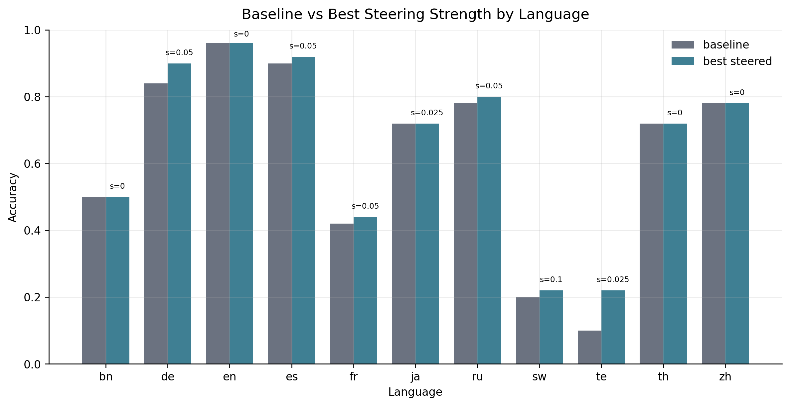
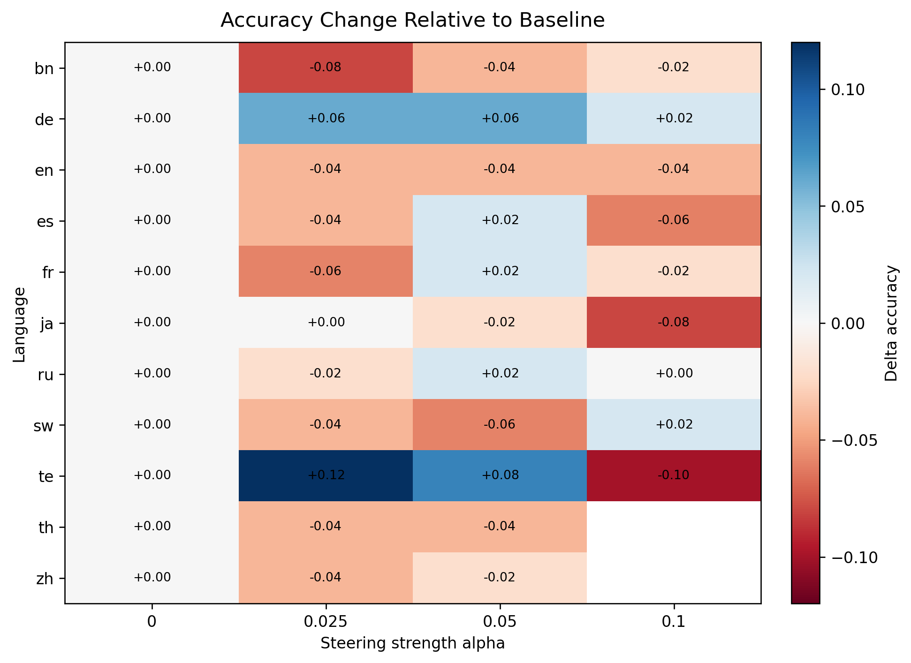
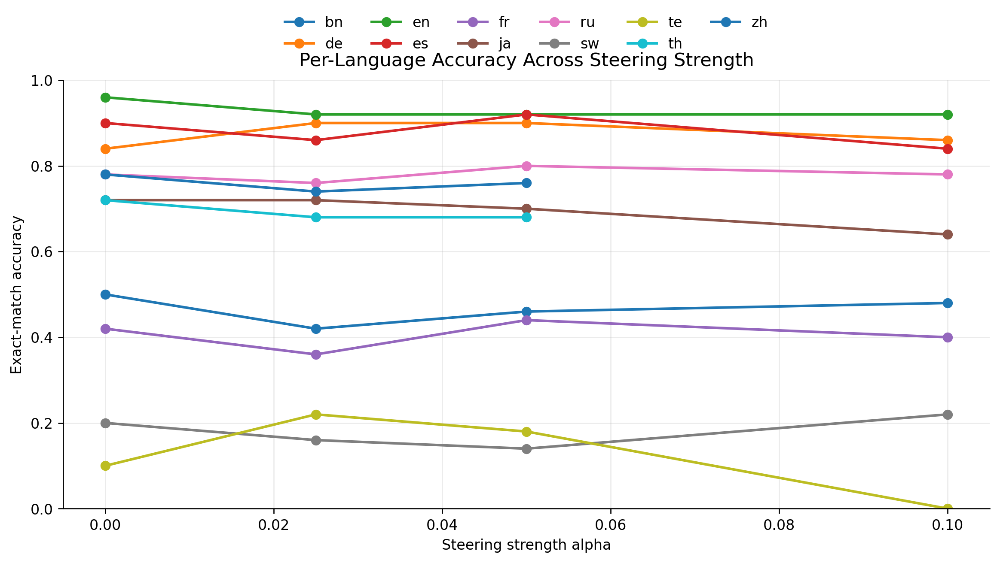
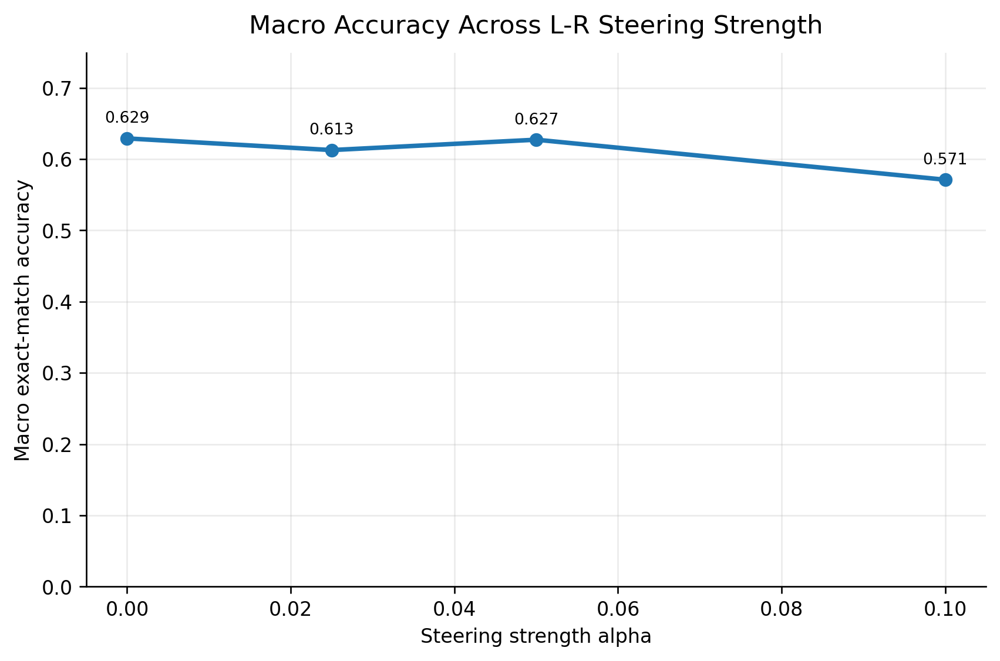
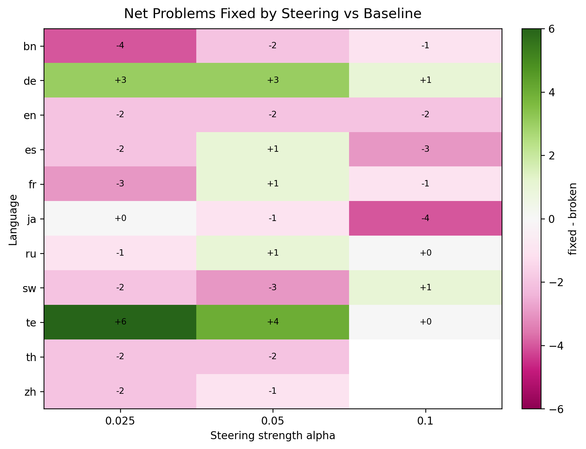
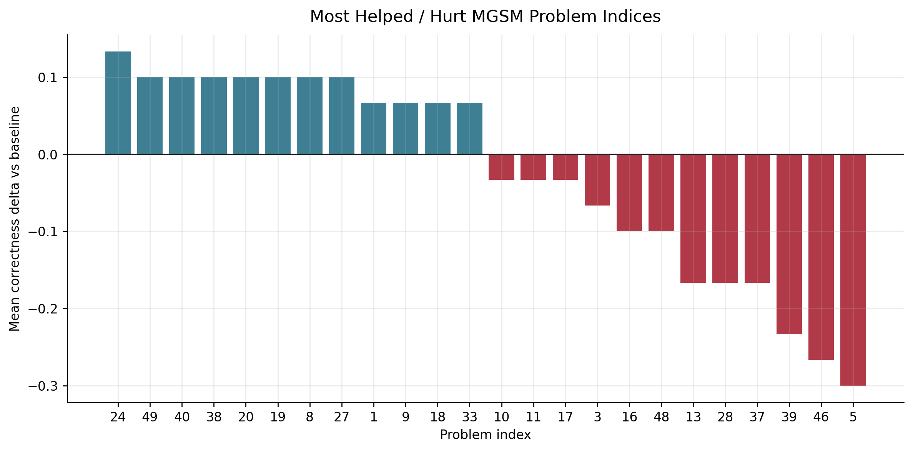

# L-R Disentanglement Steering Figures

These figures were produced from existing LatentMAS CSV outputs. No LRS or hidden-state recomputation is used.

## Included Runs

- `mgsm_first50_latent_mas_baseline`: strength `0`, `final`, source `src/multilingual-latent-reasoning/results_latent_mas_agents/Qwen3-4B/mgsm_first50_latent_mas_baseline/latent_agent_similarity_examples.csv`
- `mgsm_first50_latent_mas_lr_disentangle_s0.025`: strength `0.025`, `final`, source `src/multilingual-latent-reasoning/results_latent_mas_agents/Qwen3-4B/mgsm_first50_latent_mas_lr_disentangle_s0.025/latent_agent_similarity_examples.csv`
- `mgsm_first50_latent_mas_lr_disentangle_s0.05`: strength `0.05`, `final`, source `src/multilingual-latent-reasoning/results_latent_mas_agents/Qwen3-4B/mgsm_first50_latent_mas_lr_disentangle_s0.05/latent_agent_similarity_examples.csv`
- `mgsm_first50_latent_mas_lr_disentangle_s0.1`: strength `0.1`, `partial`, source `src/multilingual-latent-reasoning/results_latent_mas_agents/Qwen3-4B/mgsm_first50_latent_mas_lr_disentangle_s0.1/latent_agent_similarity_examples.partial.csv`

## Figures

### Baseline Vs Best Steered Accuracy

### Delta Accuracy Heatmap Vs Baseline

### Language Accuracy Curves

### Macro Accuracy Vs Steering Strength

### Net Fixed Problem Heatmap Vs Baseline

### Problem Indices Most Helped Hurt

